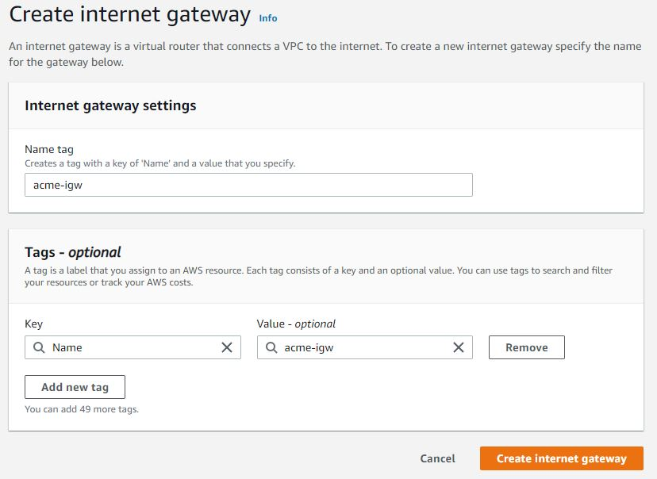

### CREATE VPC
---
- I created a VPC which will house our entire network and named it acme-vpc

- Next I enabled the DNS hostname which is disabled by default.

-- Actions

-- Edit DNS Hostname

-- I checked the enable checkbox and saved the changes  
  

---
### CREATE SUBNETS FOR THE VPC
---

### The next task is to create the subnets for the VPC

We shall be creating 6 subnets in 2 Availability zones (A and B).(3 in each zone)

The VPC CIDR is 10.0.0.0/16 (65,536 IP V4 addresses)

- 2 Public subnets 
-- public-subnet-1        [In Availability Zone A eu-west-2a]   10.0.1.0/24
-- public-subnet-2        [In Availability Zone B eu-west-2b]   10.0.2.0/24

- 4 private subnets
-- private-subnet-1       [In Availability Zone A eu-west-2a]   10.0.3.0/24 
-- private-subnet-2       [In Availability Zone B eu-west-2b]   10.0.4.0/24
-- private-subnet-3       [In Availability Zone A]   10.0.5.0/24
-- private-subnet-4       [In Availability Zone B]   10.0.6.0/24

---
### CREATE INTERNET GATEWAY
---
- The next step is to create an Internet Gateway and attach it to the VPC.

- I created an internet gateway and named it acme-igw

