### CREATE VPC
---
- I created a VPC which will house our entire network and named it acme-vpc

- Next I enabled the DNS hostname which is disabled by default.

-- Actions

-- Edit DNS Hostname

-- I checked the enable checkbox and saved the changes  
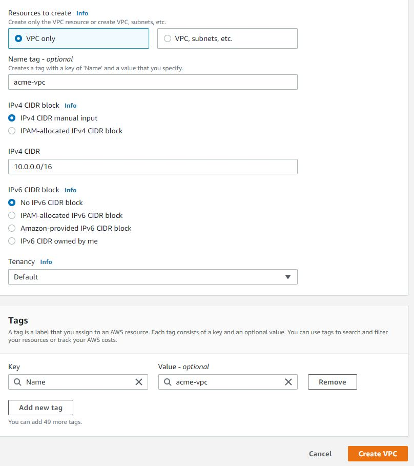  

---
### CREATE SUBNETS FOR THE VPC
---

### The next task is to create the subnets for the VPC

We shall be creating 6 subnets in 2 Availability zones (A and B).(3 in each zone)

The VPC CIDR is 10.0.0.0/16 (65,536 IP V4 addresses)

2 Public subnets 
- public-subnet-1        [In Availability Zone A eu-west-2a]   10.0.1.0/24
- public-subnet-2        [In Availability Zone B eu-west-2b]   10.0.2.0/24

4 private subnets
- private-subnet-1       [In Availability Zone A eu-west-2a]   10.0.3.0/24 
- private-subnet-2       [In Availability Zone B eu-west-2b]   10.0.4.0/24
- private-subnet-3       [In Availability Zone A]   10.0.5.0/24
- private-subnet-4       [In Availability Zone B]   10.0.6.0/24

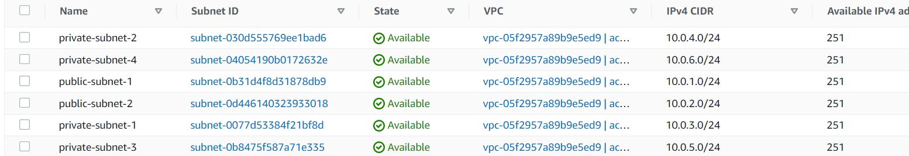

---
### CREATE ROUTE TABLES FOR THE PRIVATE AND PUBLIC SUBNETS
---

I created 2 route tables. One for the public subnets and the other for the private subnets

- acme-private-rtb
- acme-public-rtb

### ASSOCIATE ROUTE TABLES WITH SUBNETS
---
acme-private-rtb
- private-subnet-1       [In Availability Zone A eu-west-2a]   10.0.3.0/24 
- private-subnet-2       [In Availability Zone B eu-west-2b]   10.0.4.0/24
- private-subnet-3       [In Availability Zone A]   10.0.5.0/24
- private-subnet-4       [In Availability Zone B]   10.0.6.0/24

acme-public-rtb

- public-subnet-1        [In Availability Zone A eu-west-2a]   10.0.1.0/24
- public-subnet-2        [In Availability Zone B eu-west-2b]   10.0.2.0/24

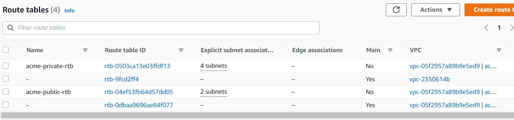

Route Table > Subnet Associations > Edit Routes > Save Associations

---
### CREATE INTERNET GATEWAY AND ATTACH TO THE VPC acme-vpc
---
- I created an internet gateway acme-igw and attached it to acme-vpc

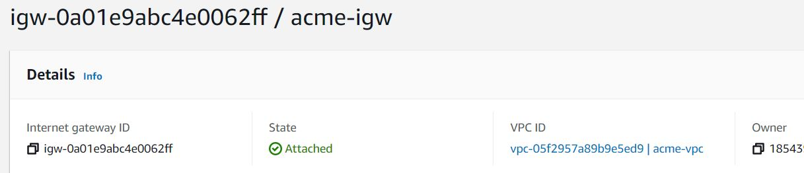
---
### CONFIGURE PUBLIC ROUTE TABLE FOR INTERNET ACCESS
---
- For the destination 0.0.0.0/0 (allow from anywhere) with target as the internet gateway acme-igw

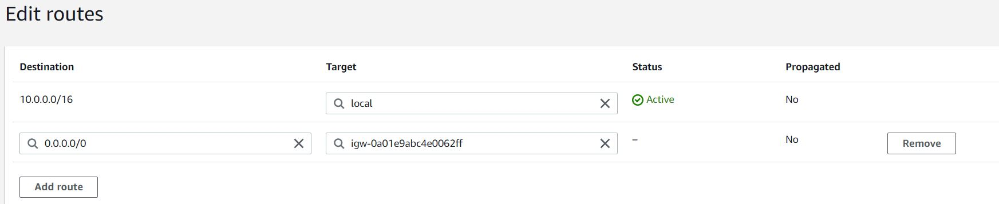

---
### CREATE A NAT GATEWAY IN THE PUBLIC SUBNET AND ATTACH AN ELASTIC IP 
---
- I created an elastic IP address named acme-NAT-elastic-ip

- I created the NAT gateway and named it acme-ngw

- Next, I attached the elastic ip to the NAT gateway in public subnet 1.
- A NAT gateway must be in a public subnet so that it can reach the internet.

 For the destination 0.0.0.0/0 (allow from anywhere) with target as the nat gateway acme-ngw

 ---
 ### CREATE THE SECURITY GROUPS
 ---

 1. External Load Balancer   acme-ext-alb-sg
 Allow http/https from anywhere. OPen port 80 and 443 from 0.0.0.0/0

 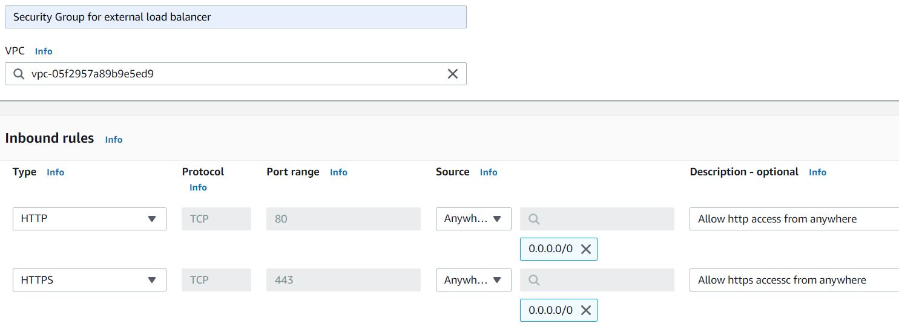

2. Bastion     acme-bastion-sg
Allow SSH from our device IP only

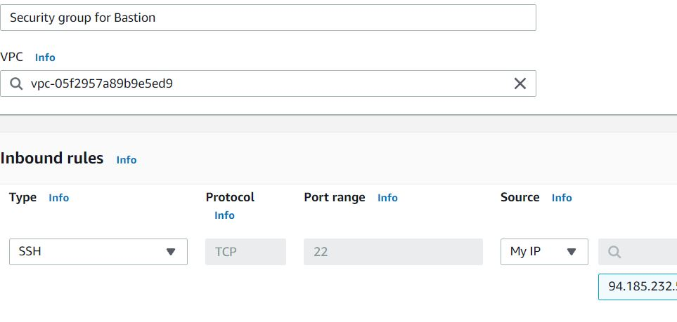  

3. Nginx Reverse  proxy server acme-nginx-sg
Allow access from port 80 and 443 from the external load balancer only 
It will only allow access from the external load balancer security group acme-ext-alb-sg  
It will allow SSH access from our Bastion

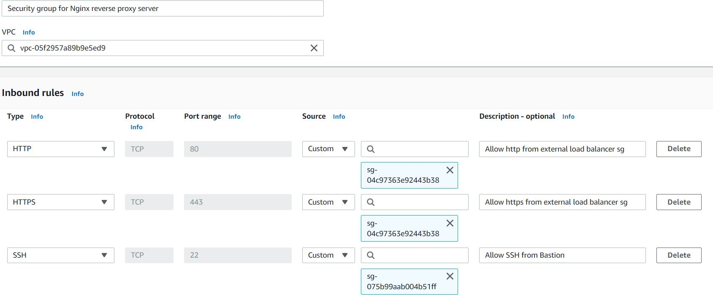  

4. Internal Load Balancer  acme-int-alb
Allow Port 80/443 access from Nginx sg

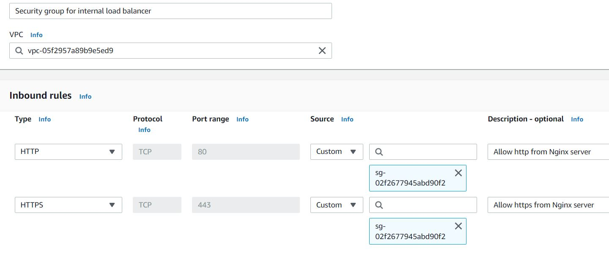

5. Web Server   acme-webserver-sg
Allow SSH from the Bastion
Allow access to port 90 and 443 from the internal load balancer acme-int-lb-sg

6. Data Layer   acme-datalayer-sg   (RDS and NFS)
Allow mysql access from Bastion
Allow mysql access from webserver
Allow NFS from webserver

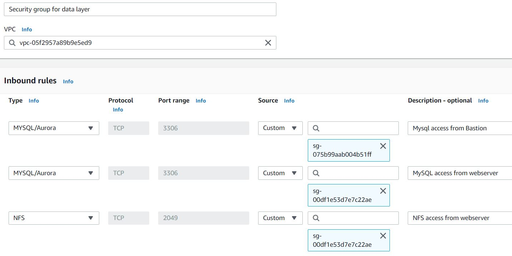  

---
### CREATE CERTIFICATE FOR SSL for workachoo.com
---
Certificate requested from AWS Certificate manager for *.workachoo.com
I selected DNS validation option
Tag: acme-cert

---
### CREATE AMAZON EFS FILE SYSTEM
---
The mount target needs to be in the same subnet as the resource that needs to access it
In this case , It is private-subnet1 and private-subnet2 i.e the webservers 
The security group is the acme-datalayer-sg

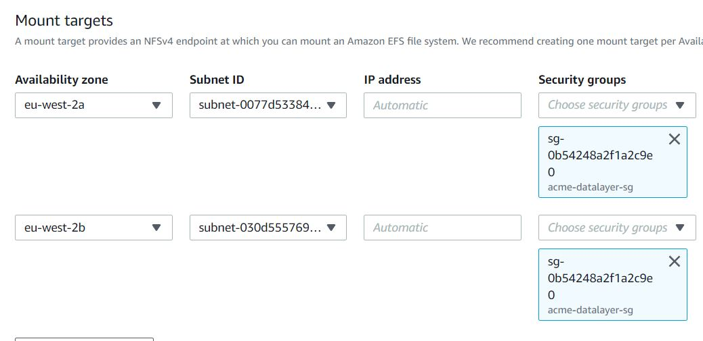 

---
### CREATE ACCESS POINTS FOR NFS FOR WORDPRESS AND TOOLING
---

[Access Points](./images/access-points-created.JPG)

---
### CREATE A KMS KEY AND A SUBNET GROUP FOR THE RDS SERVICE
---
The next step is to set up the Amazon RDS database.

Before that, we need to set up our KMS Key to encrpt the database instance.
We shall also neet to create a database subnet group.

- Create a key
- Symetric (Default)
- KMS 
- Single region (default)
- Next
- Alias: acme-rds-key
- Description: KMS for the RDS Instance

- Tags - Name: acme-rds-key

-Next
-Key adminstrator: Bandele

- KMS key successfully created.

### Next I created the subnet group

- Subnet groups
- Create DB Subnet Group
- Name: acme-rds-subnet
- Description: For RDS subnets
- Add subnets (private subnet 3 and 4)
-- acme-private-subnet-3       [In Availability Zone A eu-west-2a]   10.0.5.0/24
-- acme-private-subnet-4       [In Availability Zone B eu-west-2b]   10.0.6.0/24

- Create
- DB subnet group successfully created

### The next step is to create the database

- Dashboard
- Create Database (Amazon Aurora - Mysql ansd PostgreSQL compatible database)

- creation method: Standard create
- Engine options: MySQL
- Edition: MySQL Community
- Version: 8.0.28

Templates: Free Tier 9(To avoid costs but unable to encrpt with KMS Key)

DB Instance identifier: acme-database

Master Username: acmeadmin
Master Password: acmepassword
Public Access?:No
VPC Security Group: acme-datalayer-sg
Multi AZ deloyment disabled as free tier selected
Availability Zone: eu-west-2a but doesn't matter

Database Authentication: Password Authentication
Initial Database Name: Test
- I left all the others as default
Encryption: Encrypt with KMS deselected.

- Create database

- Database successfully created

