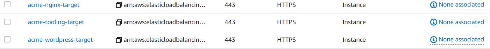

### CREATE VPC
---
- I created a VPC which will house our entire network and named it acme-vpc

- Next I enabled the DNS hostname which is disabled by default.

-- Actions

-- Edit DNS Hostname

-- I checked the enable checkbox and saved the changes  
  


---
### CREATE SUBNETS FOR THE VPC
---

### The next task is to create the subnets for the VPC

We shall be creating 6 subnets in 2 Availability zones (A and B).(3 in each zone)

The VPC CIDR is 10.0.0.0/16 (65,536 IP V4 addresses)

2 Public subnets 
- public-subnet-1        [In Availability Zone A eu-west-2a]   10.0.1.0/24
- public-subnet-2        [In Availability Zone B eu-west-2b]   10.0.2.0/24

4 private subnets
- private-subnet-1       [In Availability Zone A eu-west-2a]   10.0.3.0/24 
- private-subnet-2       [In Availability Zone B eu-west-2b]   10.0.4.0/24
- private-subnet-3       [In Availability Zone A]   10.0.5.0/24
- private-subnet-4       [In Availability Zone B]   10.0.6.0/24


---
### CREATE ROUTE TABLES FOR THE PRIVATE AND PUBLIC SUBNETS
---

I created 2 route tables. One for the public subnets and the other for the private subnets

- acme-private-rtb
- acme-public-rtb

### ASSOCIATE ROUTE TABLES WITH SUBNETS
---
acme-private-rtb
- private-subnet-1       [In Availability Zone A eu-west-2a]   10.0.3.0/24 
- private-subnet-2       [In Availability Zone B eu-west-2b]   10.0.4.0/24
- private-subnet-3       [In Availability Zone A]   10.0.5.0/24
- private-subnet-4       [In Availability Zone B]   10.0.6.0/24

acme-public-rtb

- public-subnet-1        [In Availability Zone A eu-west-2a]   10.0.1.0/24
- public-subnet-2        [In Availability Zone B eu-west-2b]   10.0.2.0/24


Route Table > Subnet Associations > Edit Routes > Save Associations


---
### CREATE INTERNET GATEWAY AND ATTACH TO THE VPC acme-vpc
---
- I created an internet gateway acme-igw and attached it to acme-vpc


---
### CONFIGURE PUBLIC ROUTE TABLE FOR INTERNET ACCESS
---
- For the destination 0.0.0.0/0 (allow from anywhere) with target as the internet gateway acme-igw


---
### CREATE A NAT GATEWAY IN THE PUBLIC SUBNET AND ATTACH AN ELASTIC IP 
---
- I created an elastic IP address named acme-NAT-elastic-ip

- I created the NAT gateway and named it acme-ngw

- Next, I attached the elastic ip to the NAT gateway in public subnet 1.
- A NAT gateway must be in a public subnet so that it can reach the internet.

 For the destination 0.0.0.0/0 (allow from anywhere) with target as the nat gateway acme-ngw


 ---
 ### CREATE THE SECURITY GROUPS
 ---

 1. External Load Balancer   acme-ext-alb-sg
 Allow http/https from anywhere. OPen port 80 and 443 from 0.0.0.0/0

 


2. Bastion     acme-bastion-sg
Allow SSH from our device IP only

  

3. Nginx Reverse  proxy server acme-nginx-sg
Allow access from port 80 and 443 from the external load balancer only 
It will only allow access from the external load balancer security group acme-ext-alb-sg  
It will allow SSH access from our Bastion

  


4. Internal Load Balancer  acme-int-alb
Allow Port 80/443 access from Nginx sg


5. Web Server   acme-webserver-sg
Allow SSH from the Bastion
Allow access to port 90 and 443 from the internal load balancer acme-int-lb-sg

6. Data Layer   acme-datalayer-sg   (RDS and NFS)
Allow mysql access from Bastion
Allow mysql access from webserver
Allow NFS from webserver

  


---
### CREATE CERTIFICATE FOR SSL for workachoo.com
---
Certificate requested from AWS Certificate manager for *.workachoo.com
I selected DNS validation option
Tag: acme-cert


---
### CREATE AMAZON EFS FILE SYSTEM
---
The mount target needs to be in the same subnet as the resource that needs to access it
In this case , It is private-subnet1 and private-subnet2 i.e the webservers 
The security group is the acme-datalayer-sg

 

---
### CREATE ACCESS POINTS FOR NFS FOR WORDPRESS AND TOOLING
---

[Access Points](./images/access-points-created.JPG)

---
### CREATE A KMS KEY AND A SUBNET GROUP FOR THE RDS SERVICE
---
The next step is to set up the Amazon RDS database.

Before that, we need to set up our KMS Key to encrpt the database instance.
We shall also neet to create a database subnet group.


- Create a key
- Symetric (Default)
- KMS 
- Single region (default)
- Next
- Alias: acme-rds-key
- Description: KMS for the RDS Instance

- Tags - Name: acme-rds-key

-Next
-Key adminstrator: Bandele

- KMS key successfully created.

### Next I created the subnet group

- Subnet groups
- Create DB Subnet Group
- Name: acme-rds-subnet
- Description: For RDS subnets
- Add subnets (private subnet 3 and 4)
-- acme-private-subnet-3       [In Availability Zone A eu-west-2a]   10.0.5.0/24
-- acme-private-subnet-4       [In Availability Zone B eu-west-2b]   10.0.6.0/24

- Create
- DB subnet group successfully created


### The next step is to create the database

- Dashboard
- Create Database (Amazon Aurora - Mysql ansd PostgreSQL compatible database)

- creation method: Standard create
- Engine options: MySQL
- Edition: MySQL Community
- Version: 8.0.28


Templates: Free Tier 9(To avoid costs but unable to encrpt with KMS Key)

DB Instance identifier: acme-database

Master Username: acmeadmin
Master Password: acmepassword
Public Access?:No
VPC Security Group: acme-datalayer-sg
Multi AZ deloyment disabled as free tier selected
Availability Zone: eu-west-2a but doesn't matter

Database Authentication: Password Authentication
Initial Database Name: Test
- I left all the others as default
Encryption: Encrypt with KMS deselected.

- Create database

- Database successfully created


### Create AMI
---
- I launched three Red Hat Instances.

### INSTALLATION ON BASTION INSTANCE
---
```
yum install -y https://dl.fedoraproject.org/pub/epel/epel-release-latest-8.noarch.rpm

yum install -y dnf-utils http://rpms.remirepo.net/enterprise/remi-release-8.rpm

yum install wget vim python3 telnet htop git mysql net-tools chrony -y

systemctl start chronyd

systemctl enable chronyd
```


---
### Nginx AMI Installation
---
```
yum install -y https://dl.fedoraproject.org/pub/epel/epel-release-latest-8.noarch.rpm

yum install -y dnf-utils http://rpms.remirepo.net/enterprise/remi-release-8.rpm

yum install wget vim python3 telnet htop git mysql net-tools chrony -y

systemctl start chronyd

systemctl enable chronyd

```

---
### Configure selinux policies for the nginx server
---
```
setsebool -P httpd_can_network_connect=1
setsebool -P httpd_can_network_connect_db=1
setsebool -P httpd_execmem=1
setsebool -P httpd_use_nfs 1
```

---
We shall install amazon efs utils for mounting the target on the Elastic file system
---
git clone https://github.com/aws/efs-utils

cd efs-utils

yum install -y make

yum install -y rpm-build

make rpm 

yum install -y  ./build/amazon-efs-utils*rpm


---
### Setting up self-signed certificate for the nginx instance
---
sudo mkdir /etc/ssl/private

sudo chmod 700 /etc/ssl/private

openssl req -x509 -nodes -days 365 -newkey rsa:2048 -keyout /etc/ssl/private/ACS.key -out /etc/ssl/certs/ACS.crt

sudo openssl dhparam -out /etc/ssl/certs/dhparam.pem 2048

###                                  ### BREAK ### BREAK ### BREAK - CONTINUE FROM WEBSERVER INSTALLATION
---
### WEBSERVER INSTALLATION
---

```
yum install -y https://dl.fedoraproject.org/pub/epel/epel-release-latest-8.noarch.rpm

yum install -y dnf-utils http://rpms.remirepo.net/enterprise/remi-release-8.rpm

yum install wget vim python3 telnet htop git mysql net-tools chrony -y

systemctl start chronyd

systemctl enable chronyd
```

### Configure selinux policies for the Webserver
---
```
setsebool -P httpd_can_network_connect=1
setsebool -P httpd_can_network_connect_db=1
setsebool -P httpd_execmem=1
setsebool -P httpd_use_nfs 1
```


--
We shall install amazon efs utils for mounting the target on the Elastic file system
---
```
git clone https://github.com/aws/efs-utils

cd efs-utils

yum install -y make

yum install -y rpm-build

make rpm 

yum install -y  ./build/amazon-efs-utils*rpm
```

---
Setting up self-signed certificate for the apache webserver instance
---
```
yum install -y mod_ssl

openssl req -newkey rsa:2048 -nodes -keyout /etc/pki/tls/private/ACS.key -x509 -days 365 -out /etc/pki/tls/certs/ACS.crt

vi /etc/httpd/conf.d/ssl.conf
```
I opened the ssl.conf file and changed localhost.crt and localhost.key to ACS.crt and ACS.key respectively

 
---
### Next, I created AMI's from the instances
---


Instance Webserver AMI
---
- Actions
- Images and Templates
- Create Image  Image Name: acme-webserver-ami
- Description: AMI For Webserver
- Tag image and snapshot together (default)
- Create Image


Instance Nginx AMI
---
-- Actions
-- Images and Templates
-- Create Image  Image Name: acme-nginx-ami
-- Description: AMI For Nginx
-- Tag image and snapshot together (default)
-- Create Image


Instance Bastion AMI
---
-- Actions
-- Images and Templates
-- Create Image  Image Name: acme-bastion-ami
-- Description: AMI For Bastion
-- Tag image and snapshot together (default)
-- Create Image

---
Time to start creating the Target Groups for the Load Balancers
---
NGINX
---
-- Load balancing
-- Target Groups
-- Target Type: Instance
-- Target Group Name: acme-nginx-target

-- Port https 443

-- Protocol version http1


-- Healthcheck path: /healthstatus

-- Tag: acme-nginx-target
-- Next

WORDPRESS
---
-- Target Type: Instance
-- Target Group Name: acme-wordpress-target

-- Port https 443

-- Protocol version http1


-- Healthcheck path: /healthstatus

-- Tag: acme-wordpress-target
-- Next


TOOLING
---

-- Target Type: Instance
-- Target Group Name: acme-tooling-target

-- Port https 443

-- Protocol version http1


-- Healthcheck path: /healthstatus

-- Tag: acme-tooling-target
-- Next




### Create the Loadbalancers

Load balancer type: Application Load Balancer
Name: acme-ext-lb
Load balancer protocol: https 
Load balancer port:443
vpc: acme-vpc
Availability zones: Public subnet1 eu-wes-2a and public subnet2 eu-west-2b

Tag: acme-ext-lb
security grouo: acme-ext-lb-sg

Target group: existing target group 
Name: acme-nginx-target

protocol: https
port: 443

' Health checks
protocol: https
path: /healthstatus

- Create


Load balancer type: Application Load Balancer
Name: acme-int-lb
Load balancer protocol: https 
Load balancer port:443
vpc: acme-vpc
Availability zones: Private subnet1 eu-west-2a and private subnet2 eu-west-2b

Tag: acme-int-lb
security group: acme-int-lb-sg

Target group: existing target group 
Name: acme-wordpress-target  - This will meke it the default target. I will configure the rules for tooling target.

protocol: https
port: 443

' Health checks
ptotocol: https
path: /healthstatus

- Create
- Go to listeners
- Select default listener
- View or Edit rules

- Insert rule
- Add condition

if host header: tooling.workachoo.com
or www.tooling.workachoo.com

- add action: acme-tooling-target

  

---
### LAUNCH TEMPLATES TO BE CREATED##########################################################
---

# BASTION LAUNCH TEMPLATE
---
acme-bastion-template

description: Template for bastion

Application and OS  Images: acme-bastion-ami

Instance type: t2.micro

Key-Pair: ansiblekey


Note: dont choose security group here

Tag:  Name
### ADD NETWORK INTERFACE
Subnet:acme-public-subnet-1

security group acme-bastion-sg

Auto-assign public IP: enable

userdata:
```
#!/bin/bash 
yum install -y mysql 
yum install -y git tmux 
yum install -y ansible
```

- Create launch template
- Successfully created

---

Create launch template
NGINX LAUNCH TEMPLATE
---
acme-nginx-template

description: Template for nginx

Application and OS  Images: acme-nginx-ami

Instance type: t2.micro

Key-Pair: ansiblekey

Tag:  Name

Subnet:acme-public-subnet-1

security group acme-nginx-revproxy-sg

Auto-assign public IP: enable

userdata:
```
#!/bin/bash
yum install -y nginx
systemctl start nginx
systemctl enable nginx
I forked https://github.com/Livingstone95/ACS-project-config.git and edited reverse.conf
and user data as follows 

USERDATA
---
git clone https://github.com/DrSaaS/ACS-project-config.git
mv /ACS-project-config/reverse.conf /etc/nginx/
mv /etc/nginx/nginx.conf /etc/nginx/nginx.conf-distro
cd /etc/nginx/
touch nginx.conf
sed -n 'w nginx.conf' reverse.conf
systemctl restart nginx
rm -rf reverse.conf
rm -rf /ACS-project-config

```

    REVERSE.CONF (EDITED HOST WITH DNS NAME OF INTERNAL LOAD BALANCER AND SERVER_NAME TO *.workachoo.com)
    ---

    ```
user nginx;
worker_processes auto;
error_log /var/log/nginx/error.log;
pid /run/nginx.pid;

# Load dynamic modules. See /usr/share/doc/nginx/README.dynamic.
include /usr/share/nginx/modules/*.conf;

events {
    worker_connections 1024;
}

http {
    log_format  main  '$remote_addr - $remote_user [$time_local] "$request" '
                      '$status $body_bytes_sent "$http_referer" '
                      '"$http_user_agent" "$http_x_forwarded_for"';

    access_log  /var/log/nginx/access.log  main;

    sendfile            on;
    tcp_nopush          on;
    tcp_nodelay         on;
    keepalive_timeout   65;
    types_hash_max_size 2048;

    
    default_type        application/octet-stream;

    # Load modular configuration files from the /etc/nginx/conf.d directory.
    # See http://nginx.org/en/docs/ngx_core_module.html#include
    # for more information.
    include /etc/nginx/conf.d/*.conf;

     server {
        listen       80;
        listen       443 http2 ssl;
        listen       [::]:443 http2 ssl;
        root          /var/www/html;
        server_name  *.workachoo.com;
        
        
        ssl_certificate /etc/ssl/certs/ACS.crt;
        ssl_certificate_key /etc/ssl/private/ACS.key;
        ssl_dhparam /etc/ssl/certs/dhparam.pem;

      

        location /healthstatus {
        access_log off;
        return 200;
       }
    
         
        location / {
            proxy_set_header             Host $host;
            proxy_pass                   https://internal-acme-int-lb-1542537714.eu-west-2.elb.amazonaws.com/; 
           }
    }
}


    ```

- Create launch template
- Successfully created


### WORDPRESS LAUNCH TEMPLATE
---
Create launch template
WORDPRESS LAUNCH TEMPLATE
---
acme-wordpress-template

description: Template for bastion

Application and OS  Images: acme-webserver-ami

Instance type: t2.micro

Key-Pair: ansiblekey

Tag:  Name: acme-wordpress-template

Subnet:acme-private-subnet-1

security group acme-webserver-sg

Auto-assign public IP: disable - Connects through NAT Gateway

### To get the accesspoint below, we musts go to our AWS file system > Access points > click on attach and copy the EFS mount helper code for wordpress
```
sudo mount -t efs -o tls,accesspoint=fsap-05ca7e81b9bc952f0 fs-0786f6c06023ceac5:/ efs

```
userdata:
```
#!/bin/bash
mkdir /var/www/
sudo mount -t efs -o tls,accesspoint=fsap-05ca7e81b9bc952f0 fs-0786f6c06023ceac5:/ /var/www/
yum install -y httpd 
systemctl start httpd
systemctl enable httpd
yum module reset php -y
yum module enable php:remi-7.4 -y
yum install -y php php-common php-mbstring php-opcache php-intl php-xml php-gd php-curl php-mysqlnd php-fpm php-json
systemctl start php-fpm
systemctl enable php-fpm
wget http://wordpress.org/latest.tar.gz
tar xzvf latest.tar.gz
rm -rf latest.tar.gz
cp wordpress/wp-config-sample.php wordpress/wp-config.php
mkdir /var/www/html/
cp -R /wordpress/* /var/www/html/
cd /var/www/html/
touch healthstatus
sed -i "s/localhost/acme-database.cpil7ry1shut.eu-west-2.rds.amazonaws.com/g" wp-config.php 
sed -i "s/username_here/acmeadmin/g" wp-config.php 
sed -i "s/password_here/acmepassword/g" wp-config.php 
sed -i "s/database_name_here/wordpressdb/g" wp-config.php 
chcon -t httpd_sys_rw_content_t /var/www/html/ -R
systemctl restart httpd


```

- Create launch template
- Successfully created


In the userdata, we must update
1. username
2. password
3. database name - create wordpressdb as not yet existent in rds using bastion
4. update RDS endpoint (acme-database.cpil7ry1shut.eu-west-2.rds.amazonaws.com}


### Next is to create the launch template for our tooling website

Create launch template
TOOLING LAUNCH TEMPLATE
---
acme-tooling-template

description: Template for bastion

Application and OS  Images: acme-webserver-ami

Instance type: t2.micro

Key-Pair: ansiblekey

Tag:  Name: acme-tooling-template

Subnet:acme-private-subnet-2

security group acme-webserver-sg

Auto-assign public IP: enable
#To get the accesspoint below, we musts go to our AWS file system > click on attach 
and copy the EFS mount helper code
```
# EFS mount code
sudo mount -t efs -o tls,accesspoint=fsap-0312e113542083fb8 fs-0bbd902fd8df2ef22:/ efs
# RDS endpoint
acme-database.cpil7ry1shut.eu-west-2.rds.amazonaws.com
```
userdata:
```
#!/bin/bash
mkdir /var/www/
sudo mount -t efs -o tls,accesspoint=fsap-0c7880228faf9c8ef fs-0786f6c06023ceac5:/ /var/www/
yum install -y httpd 
systemctl start httpd
systemctl enable httpd
yum module reset php -y
yum module enable php:remi-7.4 -y
yum install -y php php-common php-mbstring php-opcache php-intl php-xml php-gd php-curl php-mysqlnd php-fpm php-json
systemctl start php-fpm
systemctl enable php-fpm
git clone https://github.com/DrSaaS/tooling-1.git
mkdir /var/www/html
cp -R /tooling-1/html/*  /var/www/html/
cd /tooling-1
mysql -h acme-database.cpil7ry1shut.eu-west-2.rds.amazonaws.com -u acmeadmin -p toolingdb < tooling-db.sql
cd /var/www/html/
touch healthstatus
sed -i "s/$db = mysqli_connect('mysql.tooling.svc.cluster.local', 'admin', 'admin', 'tooling');
/$db = mysqli_connect('acme-database.cpil7ry1shut.eu-west-2.rds.amazonaws.com', 'acmeadmin', 'acmepassword', 'toolingdb');/g" functions.php
chcon -t httpd_sys_rw_content_t /var/www/html/ -R
systemctl restart httpd

```

- Create launch template
- Successfully created  
---


